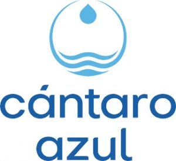

```{python}
#| include: false
import pandas as pd
import plotly.express as px
import plotly.graph_objects as go
import plotly.io as pio
import os
import pathlib

# Configurar renderer: Dejamos que Quarto maneje el widget nativamente.
# Forzar pio.renderers rompe el ResizeObserver interno de Quarto Dashboards y causa leyendas encimadas.

# Cargar dataset maestro
data_path = os.path.join("..", "datos", "final_merged_data.csv")
df = pd.read_csv(data_path, dtype={'CVEGEO': str})

# Configuración de colores consistente con el CSS
COLOR_RURAL = '#e74c3c'
COLOR_URBANO = '#3498db'

# Preparar dataset para el scatter interactivo (consumido por OJS via FileAttachment)
df_scatter = df.copy()
df_scatter['severidad'] = ((df_scatter['carencia_agua_conagua_pct'] + df_scatter['Pobreza_extrema_pct']) / 2).round(1)

_cols_ojs = ['Municipio', 'Estado', 'RHA', 'poblacion_total', 'clasificacion_rural',
             'severidad', 'carencia_agua_conagua_pct', 'Pobreza_extrema_pct']
df_ojs = df_scatter[_cols_ojs].copy()
df_ojs['poblacion_total'] = df_ojs['poblacion_total'].fillna(0).astype(int)
df_ojs['carencia_agua_conagua_pct'] = df_ojs['carencia_agua_conagua_pct'].fillna(0).round(1)
df_ojs['Pobreza_extrema_pct'] = df_ojs['Pobreza_extrema_pct'].fillna(0).round(1)
df_ojs['RHA'] = df_ojs['RHA'].fillna('N/D')
df_ojs['Municipio'] = df_ojs['Municipio'].fillna('').astype(str)
df_ojs['Estado'] = df_ojs['Estado'].fillna('').astype(str)
df_ojs['clasificacion_rural'] = df_ojs['clasificacion_rural'].fillna('N/D').astype(str)

# Persistir JSON para que OJS lo consuma con FileAttachment (patrón canónico para Quarto Dashboards)
pathlib.Path('data').mkdir(exist_ok=True)
df_ojs.to_json('data/municipios_scatter.json', orient='records', force_ascii=False)
```

```{ojs}
//| output: false
municipios_scatter = FileAttachment("data/municipios_scatter.json").json()
```

# La Ilusión Nacional {.scrolling}


## Row {height=520px}

### Column {width=55%}

::: {.executive-subtitle}
[La Estructura de la Pobreza: La Brecha Hídrica en México]{.subtitle-heading}

El cruce entre el **ODS 1 (Fin de Pobreza)** y el **ODS 6 (Agua Limpia y Saneamiento)** no es una simple estadística; es una **condena estructural**. La pobreza va más allá de la falta de ingresos; es la ausencia de los servicios básicos que permiten vivir con dignidad.
:::

### Column {width=15%}

::: {.valuebox icon="droplet-fill" color="#e3f2fd" title="Cobertura Nacional Oficial (SIODS)"}
64%
:::

### Column {width=15%}

::: {.valuebox icon="houses-fill" color="#e74c3c" title="Municipios que son Rurales"}
55%
:::

### Column {width=15%}

::: {.valuebox icon="exclamation-triangle-fill" color="#2c3e50" title="Mayor Carencia de Agua Rural"}
4.6x
:::

## Row {height=600px}

### Column {width=50%}

```{python}
#| title: "Carencia de Agua Entubada en los 2,469 Municipios de México"
import numpy as np

# Generar histograma de Carencia de Agua
fig_espejismo = px.histogram(
    df,
    x='carencia_agua_conagua_pct',
    color='clasificacion_rural',
    category_orders={'clasificacion_rural': ['Rural', 'Urbano']},
    color_discrete_map={'Urbano': COLOR_URBANO, 'Rural': COLOR_RURAL},
    nbins=40,
    labels={'carencia_agua_conagua_pct': '% de Habitantes Sin Agua Entubada', 'clasificacion_rural': 'Clasificación', 'count': 'No. de municipios'},
    opacity=0.75,
    log_y=True,
    marginal="rug" # Muestra marcas individuales para visibilizar la cola
)

_ = fig_espejismo.update_traces(
    xbins=dict(start=0, size=5),
    selector=dict(type="histogram")
)

# Post-procesamiento: inyectar población total por bin en cada trace del histograma
bin_size = 5
for trace in fig_espejismo.data:
    if trace.type != 'histogram':
        continue
    clasif = trace.name  # 'Rural' o 'Urbano'
    subset = df[df['clasificacion_rural'] == clasif]
    # Calcular bins idénticos a los del histograma (start=0, size=5)
    bin_edges = np.arange(0, df['carencia_agua_conagua_pct'].max() + bin_size, bin_size)
    bin_idx = np.digitize(subset['carencia_agua_conagua_pct'].values, bin_edges) - 1
    # Sumar población por bin
    pob_por_bin = {}
    for i, pob in zip(bin_idx, subset['poblacion_total'].values):
        pob_por_bin[i] = pob_por_bin.get(i, 0) + (int(pob) if pd.notna(pob) else 0)
    # Crear array de población formateada alineada con los bin centers
    max_bin = max(pob_por_bin.keys()) if pob_por_bin else 0
    pob_labels = []
    for i in range(max_bin + 1):
        val = pob_por_bin.get(i, 0)
        pob_labels.append(f"{val:,}")
    trace.customdata = [[p] for p in pob_labels]
    trace.hovertemplate = (
        "Clasificación=%{data.name}<br>"
        "% de Habitantes Sin Agua Entubada=%{x}<br>"
        "No. de municipios=%{y}<br>"
        "Habitantes totales=%{customdata[0]}"
        "<extra></extra>"
    )

_ = fig_espejismo.update_layout(
    font=dict(family="Inter, sans-serif", size=12),
    yaxis_title="Cantidad de Municipios<br>(Escala Logarítmica)",
    xaxis_title="Porcentaje de Población Sin Agua Entubada (CONAGUA)",
    barmode='group',
    bargap=0.1, # Espacio entre los grupos para mejor estética
    legend=dict(
        title_text="", # Elimina el título de la leyenda que causa conflictos
        orientation="h", 
        yanchor="bottom", 
        y=1.02, 
        xanchor="left", 
        x=-0.1,
        entrywidth=50, # Fuerza el ancho de los elementos sin calcular BBox
        bgcolor="rgba(255,255,255,0.8)"
    ),
    margin=dict(t=50, b=50)
)

# Añadir línea del promedio de la "Ilusión Nacional"
# Si 64% tiene agua segura, significa que 36% carece.
carencia_oficial = 36.0 
_ = fig_espejismo.add_vline(
    x=carencia_oficial, 
    line_width=3, 
    line_dash="dash", 
    line_color="black"
)

_ = fig_espejismo.add_annotation(
    x=carencia_oficial, 
    y=1.0, 
    yref="paper",
    text=f"Promedio Oficial Equivalente (~{carencia_oficial}% Sin Agua)",
    showarrow=False, 
    yshift=20,
    font=dict(size=12, color="black", family="Inter, sans-serif"),
    bgcolor="rgba(255, 255, 255, 0.9)",
    bordercolor="black",
    borderwidth=1
)

fig_espejismo
```

### Column {width=25%}

```{python}
#| title: "Distribución de Municipios a Nivel Nacional"

# Contar municipios por clasificación
municipios_count = df['clasificacion_rural'].value_counts().reset_index()
municipios_count.columns = ['Clasificación', 'Número de Municipios']

# Calcular población total por clasificación
pob_por_clasif = df.groupby('clasificacion_rural')['poblacion_total'].sum().reset_index()
pob_por_clasif.columns = ['Clasificación', 'Población Total']
municipios_count = municipios_count.merge(pob_por_clasif, on='Clasificación')

# Formatear población con comas para legibilidad
municipios_count['Pob. Formateada'] = municipios_count['Población Total'].apply(lambda x: f"{int(x):,}")

# Crear gráfico de pastel
fig = px.pie(
    municipios_count, 
    values='Número de Municipios', 
    names='Clasificación',
    color='Clasificación',
    color_discrete_map={'Urbano': COLOR_URBANO, 'Rural': COLOR_RURAL},
    hole=0.4
)

# Inyectar customdata manualmente (px.pie no maneja custom_data como px.bar)
total_pob = municipios_count['Población Total'].sum()
municipios_count['% Población'] = (municipios_count['Población Total'] / total_pob * 100).round(1)

# Crear lookup para sincronizar con el orden interno de px.pie
lookup = {}
for _, row in municipios_count.iterrows():
    hover_extra = f"Habitantes: {row['Pob. Formateada']}<br>Pob. nacional: {row['% Población']}%"
    lookup[row['Clasificación']] = hover_extra

# Leer el orden real de las rebanadas que Plotly generó
slice_order = list(fig.data[0].labels)
custom = [[lookup[label]] for label in slice_order]

# Suprimir auto-display de expresiones intermedias
_ = fig.update_traces(
    textposition='inside',
    textinfo='percent+label',
    customdata=custom,
    hovertemplate='<b>%{label}</b><br>Municipios: %{value}<br>Porcentaje: %{percent}<br>%{customdata[0]}<extra></extra>',
    marker=dict(line=dict(color='#ffffff', width=2))
)

_ = fig.update_layout(
    font=dict(family="Inter, sans-serif", size=14),
    showlegend=True,
    height=500,
    margin=dict(t=30, b=30),
    legend=dict(
        title_text="",
        orientation="h",
        yanchor="bottom",
        y=1.02,
        xanchor="center",
        x=0.5,
        entrywidth=100
    )
)

fig
```

### Column {width=25%}

::: {.context-cards-container .h-100}

::: {.context-card .card-blue .h-100}
[La Ilusión Nacional]{.card-heading}

México reporta un **64% de acceso a agua segura** a nivel nacional. Sin embargo, las grandes ciudades "promedian hacia arriba", borrando a las comunidades rurales y periféricas. Al analizar los microdatos, la estadística se derrumba. **Invisibilizar la carencia es violar un derecho humano.**
:::

::: {.context-card .card-red .h-100}
[La Realidad Demográfica]{.card-heading}

Solo el **17% de los mexicanos** vive en zonas rurales, pero esto representa **más del 55% de los municipios** del país. Si medimos por equidad territorial y no por densidad, la vida rural abarca la mayor parte de México.
:::

:::

## Row {height=550px}

### Column {width=25%}

::: {.context-cards-container .h-100}

::: {.context-card .card-indigo .h-100}
[El Veredicto Matemático]{.card-heading}

[4.6×]{.stat-highlight}
[Mayor carencia de agua en el campo]{.stat-label}

[2×]{.stat-highlight}
[Mayor pobreza extrema rural]{.stat-label}

Cruzar el Censo con la infraestructura **desmiente la "Ilusión Nacional"**. La carencia de agua entubada es **4.6 veces mayor** en el campo, y la pobreza extrema es **el doble**. La pobreza tiene una dirección postal olvidada por el presupuesto.
:::

:::

### Column {width=75%}

::: {.card title="Déficit de Agua vs. Pobreza Extrema (2,469 Municipios)"}

```{ojs}
{
  const searchInput = html`<input type="text" placeholder="Ej. Oaxaca, Guerrero..."
    style="padding: 0.5rem 0.65rem; border: 1px solid #d1d5db; border-radius: 6px;
           font-family: Inter, sans-serif; font-size: 0.95rem;
           width: min(400px, 100%); outline: none;
           transition: border-color 0.2s, box-shadow 0.2s;">`;
           
  searchInput.addEventListener("focus", () => {
    searchInput.style.borderColor = "#78350F";
    searchInput.style.boxShadow = "0 0 0 3px rgba(120, 53, 15, 0.12)";
  });
  
  searchInput.addEventListener("blur", () => {
    searchInput.style.borderColor = "#d1d5db";
    searchInput.style.boxShadow = "none";
  });

  const searchRow = html`<label style="display:flex; gap:0.75rem; align-items:center;
    font-family:Inter, sans-serif; font-weight:600; color:#1a1a1a;
    font-size:0.95rem; margin:0; padding:0; flex-wrap:wrap;">
    <span>Busca tu municipio o entidad federativa:</span>${searchInput}</label>`;

  const chartWrapper = html`<div style="flex:1; position:relative; min-height:420px; width:100%; margin-top:0.5rem;"></div>`;
  const chartEl = html`<div style="position:absolute; top:0; left:0; right:0; bottom:0; overflow:hidden;"></div>`;
  chartWrapper.append(chartEl);

  const container = html`<div style="display:flex; flex-direction:column;
    height:100%; width:100%; padding:0.25rem 0;"></div>`;

  container.append(searchRow, chartWrapper);

  // Tooltip HTML personalizado — Plot.tip NO soporta fill dinámico por canal
  // (doc oficial: "tip mark does not support the standard style channels such as varying fill").
  // Implementamos tooltip como <div> con hit-testing por búsqueda lineal O(n).
  const tooltip = html`<div style="
    position:absolute; pointer-events:none; opacity:0; left:0; top:0;
    padding:0.55rem 0.8rem; border-radius:8px;
    font-family:Inter,sans-serif; font-size:11.5px; line-height:1.55;
    box-shadow:0 6px 20px rgba(0,0,0,0.22);
    z-index:30; max-width:280px; white-space:nowrap;
    transition:opacity 0.08s ease-out;
    border:1.5px solid rgba(255,255,255,0.35);"></div>`;
  chartWrapper.append(tooltip);

  // Interpolador de color idéntico a la escala de Plot [0,35,65,100] → verde→naranja→rojo→rojo oscuro
  function severityColor(v) {
    const stops = [
      [0,   [39, 174, 96]],
      [35,  [243, 156, 18]],
      [65,  [231, 76, 60]],
      [100, [127, 29, 29]]
    ];
    v = Math.max(0, Math.min(100, v || 0));
    for (let i = 1; i < stops.length; i++) {
      const [s0, c0] = stops[i - 1];
      const [s1, c1] = stops[i];
      if (v <= s1) {
        const t = (v - s0) / (s1 - s0);
        const rr = Math.round(c0[0] + (c1[0] - c0[0]) * t);
        const gg = Math.round(c0[1] + (c1[1] - c0[1])  * t);
        const bb = Math.round(c0[2] + (c1[2] - c0[2])  * t);
        return `rgb(${rr},${gg},${bb})`;
      }
    }
    return 'rgb(127,29,29)';
  }

  // Contraste automático vía luminancia YIQ — el naranja necesita texto oscuro, el resto blanco
  function textColorFor(bg) {
    const [r, g, b] = bg.match(/\d+/g).map(Number);
    const y = 0.299 * r + 0.587 * g + 0.114 * b;
    return y > 150 ? '#0f172a' : '#ffffff';
  }

  // Estado compartido entre render() y handler de mousemove
  // pointsWithPx: Array<{d, px, py}> — posiciones en píxeles precomputadas
  let pointsWithPx = [];
  let svgCache = null;

  function render() {
    const q = searchInput.value.trim().toLowerCase();
    const hasSearch = q !== "";
    const ok = d =>
      (d.Municipio || "").toLowerCase().includes(q) ||
      (d.Estado || "").toLowerCase().includes(q);

    const activos = hasSearch ? municipios_scatter.filter(ok) : municipios_scatter;
    const inactivos = hasSearch ? municipios_scatter.filter(d => !ok(d)) : [];

    const top5_peores = municipios_scatter
      .slice()
      .sort((a, b) => (b.severidad || 0) - (a.severidad || 0))
      .slice(0, 5);

    const w = chartEl.clientWidth || 800;
    const h = (chartEl.clientHeight || 420) - 60;

    const plotFig = Plot.plot({
      width: w,
      height: h,
      marginLeft: 60,
      marginBottom: 50,
      x: { label: "% Sin Agua Entubada (CONAGUA)", grid: true },
      y: { label: "% en Pobreza Extrema (CONEVAL)", grid: true },
      color: {
        type: "linear",
        domain: [0, 35, 65, 100],
        range: ["#27ae60", "#f39c12", "#e74c3c", "#7f1d1d"],
        label: "Índice de Severidad",
        legend: true
      },
      marks: [
        Plot.dot(inactivos, {
          x: "carencia_agua_conagua_pct",
          y: "Pobreza_extrema_pct",
          fill: "#cccccc",
          opacity: 0.15,
          r: 4
        }),
        Plot.dot(activos, {
          x: "carencia_agua_conagua_pct",
          y: "Pobreza_extrema_pct",
          fill: "severidad",
          stroke: "rgba(255,255,255,0.4)",
          strokeWidth: 1,
          r: 4,
          opacity: 0.85
        }),
        Plot.arrow(top5_peores, {
          x1: (d, i) => d.carencia_agua_conagua_pct - (27 - (i * 2)),
          y1: (d, i) => d.Pobreza_extrema_pct + (18 - (i * 1)),
          x2: "carencia_agua_conagua_pct",
          y2: "Pobreza_extrema_pct",
          bend: true,
          stroke: "#4b5563",
          strokeWidth: 1.5,
          headLength: 5
        }),
        Plot.text(top5_peores, {
          x: (d, i) => d.carencia_agua_conagua_pct - (27 - (i * 2)),
          y: (d, i) => d.Pobreza_extrema_pct + (18 - (i * 1)),
          text: d => `${d.Municipio},\n${d.Estado}`,
          textAnchor: "end",
          dx: -4,
          lineHeight: 1.1,
          fill: "#1f2937",
          fontSize: 10,
          fontFamily: "Inter, sans-serif",
          fontWeight: 600,
          stroke: "white",
          strokeWidth: 4
        }),
        // Halo al hover — Plot.dot SÍ soporta fill por canal
        Plot.dot(activos, Plot.pointer({
          x: "carencia_agua_conagua_pct",
          y: "Pobreza_extrema_pct",
          fill: "severidad",
          r: 8,
          stroke: "white",
          strokeWidth: 2
        }))
      ]
    });

    chartEl.replaceChildren(plotFig);

    // Plot con legend:true retorna <figure> con MÚLTIPLES <svg> (legend ramp + plot).
    // Elegimos el SVG más grande (el plot principal) — querySelector('svg') agarraba el legend.
    let svgEl = null;
    if (plotFig.tagName && plotFig.tagName.toLowerCase() === 'svg') {
      svgEl = plotFig;
    } else {
      const svgs = plotFig.querySelectorAll('svg');
      let maxArea = -1;
      for (const s of svgs) {
        const r = s.getBoundingClientRect();
        const area = (r.width || 0) * (r.height || 0);
        if (area > maxArea) { maxArea = area; svgEl = s; }
      }
      // Fallback si todos tienen dimensiones 0 (no-rendered yet): el último
      if (!svgEl && svgs.length > 0) svgEl = svgs[svgs.length - 1];
    }

    if (!svgEl) {
      console.warn('[scatter-tip] no SVG en plotFig');
      pointsWithPx = [];
      svgCache = null;
      return;
    }

    // Extraer escalas — API oficial Plot 0.6.11: plot.scale(name).apply(value) → pixel
    let xApply = null, yApply = null;
    try {
      const xs = plotFig.scale("x");
      const ys = plotFig.scale("y");
      if (xs && typeof xs.apply === "function") xApply = v => xs.apply(v);
      if (ys && typeof ys.apply === "function") yApply = v => ys.apply(v);
      if (xApply && yApply) {
        const tx = xApply(50), ty = yApply(50);
        if (!Number.isFinite(tx) || !Number.isFinite(ty)) { xApply = null; yApply = null; }
      }
    } catch (err) { /* fallback below */ }

    // Fallback: reconstruir escala lineal manualmente si plot.scale falla
    if (!xApply || !yApply) {
      const xVals = municipios_scatter.map(d => d.carencia_agua_conagua_pct || 0);
      const yVals = municipios_scatter.map(d => d.Pobreza_extrema_pct || 0);
      const xMax = Math.max(...xVals);
      const yMax = Math.max(...yVals);
      const actualW = svgEl.clientWidth || w;
      const actualH = svgEl.clientHeight || h;
      const marginL = 60, marginR = 20, marginT = 20, marginB = 50;
      xApply = v => marginL + (v / xMax) * (actualW - marginL - marginR);
      yApply = v => (actualH - marginB) - (v / yMax) * (actualH - marginB - marginT);
    }

    // Precomputar posiciones en píxeles + filtrar NaN (si domain no matchea datos)
    pointsWithPx = activos
      .map(d => ({
        d,
        px: xApply(d.carencia_agua_conagua_pct),
        py: yApply(d.Pobreza_extrema_pct)
      }))
      .filter(p => Number.isFinite(p.px) && Number.isFinite(p.py));

    svgCache = svgEl;
    svgEl.style.cursor = "crosshair";
    // Listener backup directo en SVG por si chartWrapper pierde eventos
    svgEl.addEventListener("mousemove", handleMouseMove);
  }

  function handleMouseMove(event) {
    if (!svgCache || pointsWithPx.length === 0) {
      tooltip.style.opacity = 0;
      return;
    }

    const svgRect = svgCache.getBoundingClientRect();
    const mx = event.clientX - svgRect.left;
    const my = event.clientY - svgRect.top;

    if (mx < 0 || my < 0 || mx > svgRect.width || my > svgRect.height) {
      tooltip.style.opacity = 0;
      return;
    }

    // Búsqueda lineal O(n) — 2469 puntos × 60fps = 148k ops/s, trivial
    let bestIdx = -1;
    let bestDist = Infinity;
    for (let i = 0; i < pointsWithPx.length; i++) {
      const p = pointsWithPx[i];
      const dx = p.px - mx;
      const dy = p.py - my;
      const dist = dx * dx + dy * dy;
      if (dist < bestDist) {
        bestDist = dist;
        bestIdx = i;
      }
    }

    // Umbral 40px (1600 = 40²)
    if (bestIdx < 0 || bestDist > 1600) {
      tooltip.style.opacity = 0;
      return;
    }

    const pt = pointsWithPx[bestIdx].d;

    const bg = severityColor(pt.severidad);
    const fg = textColorFor(bg);
    tooltip.style.background = bg;
    tooltip.style.color = fg;
    tooltip.innerHTML =
      `<div style="font-weight:700;margin-bottom:3px;">${pt.Municipio}, ${pt.Estado}</div>` +
      `<div style="opacity:0.92;">RHA: ${pt.RHA}</div>` +
      `<div style="opacity:0.92;">Población: ${pt.poblacion_total.toLocaleString("es-MX")}</div>` +
      `<div style="opacity:0.92;">Clasificación: ${pt.clasificacion_rural}</div>` +
      `<div style="margin-top:3px;font-weight:600;">Severidad: ${pt.severidad}</div>` +
      `<div>% Sin Agua: ${pt.carencia_agua_conagua_pct}%</div>` +
      `<div>% Pobreza Extrema: ${pt.Pobreza_extrema_pct}%</div>`;

    // Medir después de set innerHTML (offsetWidth/Height funcionan con opacity:0)
    const tipW = tooltip.offsetWidth;
    const tipH = tooltip.offsetHeight;

    // Posicionar relativo a chartWrapper (donde vive el tooltip)
    const wrapperRect = chartWrapper.getBoundingClientRect();
    const localX = event.clientX - wrapperRect.left;
    const localY = event.clientY - wrapperRect.top;

    let tx = localX + 14;
    let ty = localY + 14;
    if (tx + tipW > wrapperRect.width) tx = localX - tipW - 14;
    if (ty + tipH > wrapperRect.height) ty = localY - tipH - 14;
    if (tx < 0) tx = 4;
    if (ty < 0) ty = 4;

    tooltip.style.left = `${tx}px`;
    tooltip.style.top = `${ty}px`;
    tooltip.style.opacity = 1;
  }

  chartWrapper.addEventListener("mousemove", handleMouseMove);
  chartWrapper.addEventListener("mouseleave", () => { tooltip.style.opacity = 0; });

  searchInput.addEventListener("input", render);
  requestAnimationFrame(() => requestAnimationFrame(render));

  const ro = new ResizeObserver(() => render());
  ro.observe(chartWrapper);

  invalidation.then(() => {
    ro.disconnect();
    chartWrapper.removeEventListener("mousemove", handleMouseMove);
  });

  return container;
}
```

:::


## Row {height=650px}

### Column {width=55%}

```{python}
#| title: "Cobertura de Agua(%) por Estado"
#| warning: false
#| message: false
import json

# 1. Cargar el Catálogo Nacional de Estados
df_estados_mapa_f4 = pd.read_csv('../datos/Estado.csv', dtype={'clvedo': str})

# 2. Cargar los Datos de Cobertura
df_cobertura_f4 = pd.read_excel('../datos/Población con acceso al agua en el año 2020.xlsx')

# 3. Calcular métricas por estado
df_50_f4 = df_cobertura_f4[df_cobertura_f4['Población Cobertura(%)'] <= 50].groupby('Entidad').size().reset_index(name='Municipios <= 50%')
df_70_f4 = df_cobertura_f4[(df_cobertura_f4['Población Cobertura(%)'] > 50) & (df_cobertura_f4['Población Cobertura(%)'] <= 70)].groupby('Entidad').size().reset_index(name='Municipios 50-70%')
df_100_f4 = df_cobertura_f4[df_cobertura_f4['Población Cobertura(%)'] > 70].groupby('Entidad').size().reset_index(name='Municipios > 70%')

# Calcular promedios/sumatorias de población
df_pob_f4 = df_cobertura_f4.groupby('Entidad').agg({
    'Población': 'sum',
    'Población  con agua entubada en vivienda o predio': 'sum'
}).reset_index()

df_pob_f4.rename(columns={
    'Población': 'Pob_Total',
    'Población  con agua entubada en vivienda o predio': 'Pob_Agua'
}, inplace=True)

# Municipio con menor cobertura por estado (foco crítico)
df_worst_f4 = (
    df_cobertura_f4
    .sort_values('Población Cobertura(%)')
    .groupby('Entidad', as_index=False)
    .first()[['Entidad', 'Municipio', 'Población Cobertura(%)']]
    .rename(columns={'Municipio': 'Muni_Rezago', 'Población Cobertura(%)': 'Muni_Cobertura_Pct'})
)

# 4. Unir cálculos al DataFrame de estados
df_estados_mapa_f4 = df_estados_mapa_f4.merge(df_50_f4, left_on='estado', right_on='Entidad', how='left').drop(columns=['Entidad'])
df_estados_mapa_f4 = df_estados_mapa_f4.merge(df_70_f4, left_on='estado', right_on='Entidad', how='left').drop(columns=['Entidad'])
df_estados_mapa_f4 = df_estados_mapa_f4.merge(df_100_f4, left_on='estado', right_on='Entidad', how='left').drop(columns=['Entidad'])
df_estados_mapa_f4 = df_estados_mapa_f4.merge(df_pob_f4, left_on='estado', right_on='Entidad', how='left').drop(columns=['Entidad'])
df_estados_mapa_f4 = df_estados_mapa_f4.merge(df_worst_f4, left_on='estado', right_on='Entidad', how='left').drop(columns=['Entidad'])

for col in ['Municipios <= 50%', 'Municipios 50-70%', 'Municipios > 70%']:
    df_estados_mapa_f4[col] = df_estados_mapa_f4[col].fillna(0).astype(int)

# Población sin agua entubada + municipio más rezagado formateados
df_estados_mapa_f4['Pob_Sin_Agua'] = (df_estados_mapa_f4['Pob_Total'].fillna(0) - df_estados_mapa_f4['Pob_Agua'].fillna(0)).clip(lower=0)
df_estados_mapa_f4['Pob_Sin_Agua_Fmt'] = df_estados_mapa_f4['Pob_Sin_Agua'].apply(lambda x: f"{int(x):,}")
df_estados_mapa_f4['Muni_Sin_Agua_Pct_Fmt'] = df_estados_mapa_f4['Muni_Cobertura_Pct'].apply(
    lambda x: f"{100 - x:.1f}" if pd.notna(x) else "N/D"
)

# Formatear la población con separador de miles
df_estados_mapa_f4['Pob_Total_Fmt'] = df_estados_mapa_f4['Pob_Total'].fillna(0).apply(lambda x: f"{int(x):,}")
df_estados_mapa_f4['Pob_Agua_Fmt'] = df_estados_mapa_f4['Pob_Agua'].fillna(0).apply(lambda x: f"{int(x):,}")

# 5. Asignar Categorías de Riesgo
def clasificar_vulnerabilidad_f4(cantidad):
    if cantidad == 0:
        return 'Cobertura de agua (>70%)'
    elif 1 <= cantidad <= 3:
        return 'Cobertura de agua (50-70%)'
    else:
        return 'Cobertura de agua (<50%)'

df_estados_mapa_f4['Categoría'] = df_estados_mapa_f4['Municipios <= 50%'].apply(clasificar_vulnerabilidad_f4)

# 6. Cargar GeoJSON de Estados
with open('../datos/Estado_lite.json', 'r', encoding='utf-8') as f:
    geojson_estados_f4 = json.load(f)

# Colores en tonos azules
color_map_azules_f4 = {
    'Cobertura de agua (>70%)': '#154360',
    'Cobertura de agua (50-70%)': '#5dade2',
    'Cobertura de agua (<50%)': '#d6eaf8',
}

# 7. Renderizar Mapa Choropleth
fig_map_f4 = px.choropleth(
    df_estados_mapa_f4,
    geojson=geojson_estados_f4,
    locations='clvedo',
    featureidkey='properties.clvedo',
    color='Categoría',
    category_orders={'Categoría': ['Gran cobertura de agua', 'Cobertura media de agua', 'Baja cobertura de agua']},
    color_discrete_map=color_map_azules_f4,
    hover_name='estado',
    custom_data=[
        'Categoría',           # [0]
        'Municipios <= 50%',   # [1]
        'Municipios 50-70%',   # [2]
        'Municipios > 70%',    # [3]
        'Pob_Total_Fmt',       # [4]
        'Pob_Agua_Fmt',        # [5]
        'Pob_Sin_Agua_Fmt',    # [6]
        'Muni_Rezago',         # [7]
        'Muni_Sin_Agua_Pct_Fmt' # [8]
    ]
)

_ = fig_map_f4.update_traces(
    hovertemplate=(
        "<b>%{hovertext}</b><br><br>"
        "<b>%{customdata[6]} personas sin acceso a agua entubada.</b><br><br>"
        "<b>Foco Crítico Municipal:</b><br>"
        "%{customdata[7]} es el municipio más rezagado (%{customdata[8]}% sin agua).<br><br>"
        "<b>Panorama Municipal:</b><br>"
        "Críticos (≤ 50% agua): <b>%{customdata[1]}</b><br>"
        "En Riesgo (50-70% agua): <b>%{customdata[2]}</b><br>"
        "Seguros (> 70% agua): <b>%{customdata[3]}</b>"
        "<extra></extra>"
    ),
    marker_line_color='#000000',
    marker_line_width=0.6
)

for trace in fig_map_f4.data:
    cat = trace.name
    if cat in color_map_azules_f4:
        bg_color = color_map_azules_f4[cat]
        # Si es el color más claro, texto oscuro para contraste
        font_color = '#0f172a' if cat == 'Cobertura de agua (<50%)' else '#ffffff'
        trace.hoverlabel = dict(bgcolor=bg_color, font_color=font_color)

_ = fig_map_f4.update_geos(fitbounds="locations", visible=False)
_ = fig_map_f4.update_layout(
    margin={"r":0,"t":0,"l":0,"b":40},
    font=dict(family="Inter, sans-serif", size=15),
    legend=dict(
        title_text="",
        orientation="h",
        yanchor="top",
        y=0.0,
        xanchor="left",
        x=0.0,
        entrywidth=250,
        bgcolor="rgba(255, 255, 255, 0.8)"
    ),
    dragmode=False
)

fig_map_f4
```

### Column {width=45%}

```{python}
#| title: "Municipios con Mayor Rezago de Infraestructura Hidríca"

# 1. Filtrar y extraer los 15 casos más severos
df_aislados_f4 = df.sort_values(by=['carencia_agua_conagua_pct', 'Pobreza_extrema_pct'], ascending=[False, False])

# Tomar el Top 15 y ordenar ascendente
df_top15_f4 = df_aislados_f4.head(15).copy()
df_top15_f4 = df_top15_f4.sort_values(by='carencia_agua_conagua_pct', ascending=True)

# Crear etiqueta de eje Y
df_top15_f4['Municipio_Estado'] = df_top15_f4['Municipio'] + ", " + df_top15_f4['Estado']

# Formatear números para el hover
df_top15_f4['Total Habitantes'] = df_top15_f4['poblacion_total'].astype(int).apply(lambda x: f"{x:,}")
df_top15_f4['% Sin Agua'] = df_top15_f4['carencia_agua_conagua_pct'].round(1)
df_top15_f4['% Pob. Extrema'] = df_top15_f4['Pobreza_extrema_pct'].apply(lambda x: f"{x:.1f}%" if pd.notna(x) else "N/D")

# Generar gráfica de barras horizontales
fig_rezago_f4 = px.bar(
    df_top15_f4,
    x='% Sin Agua',
    y='Municipio_Estado',
    orientation='h',
    color='clasificacion_rural',
    color_discrete_map={'Urbano': COLOR_URBANO, 'Rural': COLOR_RURAL},
    custom_data=['Total Habitantes', '% Pob. Extrema', 'clasificacion_rural']
)

_ = fig_rezago_f4.update_layout(
    yaxis={'categoryorder': 'array', 'categoryarray': df_top15_f4['Municipio_Estado'].tolist()},
    showlegend=False
)

_ = fig_rezago_f4.update_traces(
    hovertemplate="<b>%{y}</b><br>Tipo: %{customdata[2]}<br>% Sin Agua: %{x}%<br>Habitantes: %{customdata[0]}<br>Pobreza Extrema: %{customdata[1]}<extra></extra>"
)

_ = fig_rezago_f4.add_vline(
    x=36.0,
    line_width=2,
    line_dash="dash",
    line_color="#1a1a1a"
)

_ = fig_rezago_f4.update_layout(
    font=dict(family="Inter, sans-serif", size=12),
    xaxis_title="% de Población Sin Agua Entubada",
    yaxis_title="",
    margin=dict(l=10, r=20, t=30, b=40),
    xaxis=dict(range=[0, 105])
)

fig_rezago_f4
```

::: {.context-cards-container .h-100}

::: {.context-card .card-slate .h-100}
[El Costo de la Lejanía]{.card-heading}

[¿Rentabilidad Política o Equidad Social?]{.stat-highlight} Entubar agua en una ciudad densa es rápido y rentable. Llevarla a comunidades dispersas exige voluntad. Las políticas públicas priorizan el volumen, convirtiendo la **distancia física** en **distancia social**.
:::

:::


## Row

::: {.cta-container}
[Detrás de cada estadística hay una historia, y detrás de cada carencia, una oportunidad de acción.]{.cta-title}

::: {.cta-subtext}
Conoce a las personas que viven esta realidad y a las organizaciones que están cambiando el mapa.
:::

[Conocer el Rostro Humano y las Soluciones ➔](#accion-positiva){.btn-cta}
:::


# Acción Positiva {#accion-positiva .seccion-humana .scrolling}

## Row {height=155px}

### Column {width=58%}

::: {.card-tiempo}
::: {.card-tiempo-main}
[El Ladrón de Tiempo]{.card-tiempo-heading}

La falta de infraestructura es una **factura social**. El tiempo que mujeres y niños dedican a acarrear agua es tiempo robado a la educación y al trabajo remunerado.
:::
:::

### Column {width=20%}

::: {.valuebox icon="people-fill" color="#2c3e50" title="Personas sin acceso a agua entubada"}
4.92M
:::

### Column {width=20%}

::: {.valuebox icon="exclamation-diamond-fill" color="#922B21" title="Sin agua y en pobreza extrema"}
1.08M
:::

## Row {height=700px}

### Column {width=50%}

::: {.testimonios-col}

::: {.testimonio-card}
::: {.testimonio-img}

:::
::: {.testimonio-texto}
> *"Me gustaría tener una regadera… nada más de ir a abrir la llave y ya sale el agua… y no preocuparte de que tienes que ir a traer agua"*

[**Angel Arroyo**, Xicotlán — Azteca Noticias, 2024]{.testimonio-dato}
:::
:::

::: {.testimonio-card}
::: {.testimonio-img}

:::
::: {.testimonio-texto}
> *"Antes caían aguacerazos y nunca juntábamos el agua, ni siquiera para el baño. No la valoramos hasta llegar aquí, donde vine a sufrir de verdad, a sentir lo que es no tener agua".*

[**Sonia Hernández**, Tetacalanco Xochimilco — Isla Urbana, Historias de agua]{.testimonio-dato}
:::
:::

:::

### Column {width=50%}

::: {.testimonios-col}

::: {.testimonio-card}
::: {.testimonio-img}

:::
::: {.testimonio-texto}
> *"Cuando la pipa no llega, mi mamá pide prestada agua con las vecinas."*

[**Cochoapa el Grande**, Guerrero — 82% pobreza extrema]{.testimonio-dato}
:::
:::

::: {.testimonio-card}
::: {.testimonio-img}

:::
::: {.testimonio-texto}
> *"Acarrear agua es trabajo de mujeres. El hombre trabaja fuera; nosotras sostenemos la casa sin sueldo."*

[**San Andrés Duraznal**, Chiapas — 68% sin agua]{.testimonio-dato}
:::
:::

:::

## Row

### Column {width=50%}

```{python}
#| title: "ONGs con impacto en infraestructura hídrica en México"

# 1. Cargar el Catálogo Nacional de Estados
df_estados = pd.read_csv('../datos/Estado.csv', dtype={'clvedo': str})

# 2. Cargar los Datos de Proyectos Sociales
df_proyectos = pd.read_csv('../datos/proyectos_agua.csv')

# Homologar nombres de estados para cruzar correctamente
estandarizacion_estados = {
    'Coahuila': 'Coahuila de Zaragoza',
    'Estado de México': 'México',
    'Veracruz': 'Veracruz de Ignacio de la Llave'
}
df_proyectos['Estado'] = df_proyectos['Estado'].replace(estandarizacion_estados)

# 3. Agrupar la presencia de ONGs por estado
df_agregado = df_proyectos.groupby('Estado').agg(
    Num_ONGs=('Fundacion', 'count'),
    Fundaciones=('Fundacion', lambda x: '<br>• ' + '<br>• '.join(x)),
    Impactos=('Tipo_de_Impacto', lambda x: '<br>- ' + '<br>- '.join(x))
).reset_index()

# 4. Generar el dataframe final uniendo ambos con un LEFT JOIN
df_mapa = pd.merge(df_estados, df_agregado, left_on='estado', right_on='Estado', how='left')

df_mapa['Num_ONGs'] = df_mapa['Num_ONGs'].fillna(0).astype(int)
df_mapa['Fundaciones'] = df_mapa['Fundaciones'].fillna('Sin Organizaciones Registradas')
df_mapa['Impactos'] = df_mapa['Impactos'].fillna('Sin Intervención')

# Crear la leyenda categórica (0, 1, 2, 3+)
def clasificar_intensidad(ong_count):
    if ong_count == 0:
        return 'Sin Registro (0)'
    elif ong_count == 1:
        return 'Presencia (1)'
    elif ong_count == 2:
        return 'Impacto Regional (2)'
    else:
        return 'Alto Impacto (3+)'

df_mapa['Nivel_Impacto'] = df_mapa['Num_ONGs'].apply(clasificar_intensidad)

# Custom color map — gradiente de 4 niveles para tema oscuro
color_map_ongs = {
    'Sin Registro (0)': '#ffffff',            # Arena cálida
    'Presencia (1)': '#aed6f1',               # Azul claro suave
    'Impacto Regional (2)': '#3498db',        # Azul medio vibrante
    'Alto Impacto (3+)': '#1a5276'            # Azul profundo institucional
}

# 5. Cargar GeoJSON de Estados
with open('../datos/Estado_lite.json', 'r', encoding='utf-8') as f:
    geojson_estados = json.load(f)

# 6. Renderizar Mapa Choropleth
fig_ongs = px.choropleth(
    df_mapa,
    geojson=geojson_estados,
    locations='clvedo',
    featureidkey='properties.clvedo', 
    color='Nivel_Impacto',
    category_orders={'Nivel_Impacto': ['Sin Registro (0)', 'Presencia (1)', 'Impacto Regional (2)', 'Alto Impacto (3+)']},
    color_discrete_map=color_map_ongs,
    hover_name='estado',
    custom_data=['Fundaciones', 'Impactos', 'Num_ONGs']
)

# Custom Hover Text
_ = fig_ongs.update_traces(
    hovertemplate="<b>%{hovertext}</b><br><br>" +
    "Organizaciones Activas: %{customdata[2]}<br>" +
    "<b>Fundaciones:</b>%{customdata[0]}<br><br>" +
    "<b>Impactos:</b>%{customdata[1]}" +
    "<extra></extra>"
)

# Bordes definidos para distinguir estados
_ = fig_ongs.update_traces(marker_line_color='#566573', marker_line_width=0.8)

# Hover tooltip color = color de cada categoría
hover_colors = {
    'Sin Registro (0)': '#95a5a6',
    'Presencia (1)': '#5dade2',
    'Impacto Regional (2)': '#2471a3',
    'Alto Impacto (3+)': '#1a5276'
}
for trace in fig_ongs.data:
    cat = trace.name
    if cat in hover_colors:
        trace.hoverlabel = dict(bgcolor=hover_colors[cat], font_color='white')

_ = fig_ongs.update_geos(
    fitbounds="locations",
    visible=False,
    projection_type="mercator"
)

_ = fig_ongs.update_layout(
    margin={"r":0,"t":0,"l":0,"b":0},
    font=dict(family="Inter, sans-serif", size=12),
    legend=dict(
        title_text="",
        orientation="h",
        yanchor="top",
        y=0.0,
        xanchor="left",
        x=0.0,
        entrywidth=170,
        bgcolor="rgba(255, 255, 255, 0.8)"
    ),
    dragmode=False
)

fig_ongs
```

### Column {width=50%}

::: {.motor-cambio-container}

::: {.solucion-card}
[La Estadística no es Destino]{.solucion-heading}

Donde el presupuesto no llega, la **innovación social** da un paso al frente. No se espera el futuro, se construye gota a gota.
:::

::: {.aliados-grid}

::: {.aliado-mini}
{.aliado-logo}

[**Fundación Río Arronte** — El músculo financiero en zonas de estrés hídrico.]{.aliado-texto}
:::

::: {.aliado-mini}
{.aliado-logo}

[**CEMDA** — Defensa legal frente a la explotación del recurso.]{.aliado-texto}
:::

::: {.aliado-mini}
{.aliado-logo}

[**Cántaro Azul** — Ecotecnias de purificación para escuelas excluidas.]{.aliado-texto}
:::

::: {.aliado-mini}
::: {.aliado-logo-dual}
{.aliado-logo}
{.aliado-logo}
:::

[**PNUD y FEMSA** — Resiliencia e infraestructura comunitaria.]{.aliado-texto}
:::

:::

:::


# Explorador de Datos

Microdatos de los municipios de la República Mexicana. Basada en fuentes oficiales. Para más información consulta nuestro [repositorio de datos](https://github.com/linuxitOS-hackODS/linuxitOS-HackODS-UNAM/tree/main/datos){target="_blank"}.

```{python}

from itables import show
import pandas as pd

# Localización profesional en español
language_explorador = {
    "search": "Buscar:",
    "lengthMenu": "Mostrar _MENU_ registros",
    "info": "Mostrando de _START_ a _END_ municipios",
    "infoEmpty": "0 municipios",
    "infoFiltered": "(filtrados de _MAX_ total)",
    "paginate": {
        "next": "Siguiente",
        "previous": "Anterior",
        "first": "Primero",
        "last": "Último"
    },
    "zeroRecords": "No se encontraron coincidencias",
    "emptyTable": "Sin datos disponibles",
    "loadingRecords": "Cargando...",
    "processing": "Procesando..."
}

# =============================================================================
# PREPARACIÓN Y TRANSFORMACIÓN DE DATOS
# =============================================================================

# Selección de columnas con orden lógico:
# 1. Identificación geográfica
# 2. Información demográfica
# 3. Indicadores ODS 1 (Pobreza)
# 4. Indicadores ODS 6 (Agua)
df_explorador = df[[
    'CVEGEO',
    'Estado',
    'Municipio',
    'poblacion_total',
    'pct_rural',
    'clasificacion_rural',
    'Pobreza_pct',
    'Pobreza_extrema_pct',
    'Carencia_servicios_pct',
    'cobertura_agua_conagua_pct',
    'RHA'
]].copy()

# Renombrado profesional de columnas
df_explorador.columns = [
    'CVE GEO',
    'Estado',
    'Municipio',
    'Población',
    '% Población Rural',
    'Clasificación',
    '% Pobreza',
    '% Pobreza Extrema',
    '% Carencia Servicios',
    '% Cobertura Agua',
    'Región Hidrológica'
]

# Formateo de datos numéricos para presentación profesional
# Reemplazar NaN antes de formatear para evitar "nan%"
cols_pct = [
    '% Población Rural',
    '% Pobreza',
    '% Pobreza Extrema',
    '% Carencia Servicios',
    '% Cobertura Agua'
]
df_explorador['Población'] = df_explorador['Población'].apply(
    lambda x: f"{int(x):,}".replace(",", " ") if pd.notna(x) else "N/D"
)
df_explorador['% Población Rural'] = df_explorador['% Población Rural'].map(lambda x: f"{x:.1f}%" if pd.notna(x) else "N/D")
df_explorador['% Pobreza'] = df_explorador['% Pobreza'].map(lambda x: f"{x:.2f}%" if pd.notna(x) else "N/D")
df_explorador['% Pobreza Extrema'] = df_explorador['% Pobreza Extrema'].map(lambda x: f"{x:.2f}%" if pd.notna(x) else "N/D")
df_explorador['% Carencia Servicios'] = df_explorador['% Carencia Servicios'].map(lambda x: f"{x:.2f}%" if pd.notna(x) else "N/D")
df_explorador['% Cobertura Agua'] = df_explorador['% Cobertura Agua'].map(lambda x: f"{x:.2f}%" if pd.notna(x) else "N/D")

# =============================================================================
# RENDERIZADO DE TABLA INTERACTIVA
# =============================================================================

show(
    df_explorador,
    classes=["display", "cell-border", "stripe"],
    lengthMenu=[25, 50, 100, 250],
    pageLength=25,
    dom="frtip",
    order=[[0, "asc"]],
    language=language_explorador,
)
```
